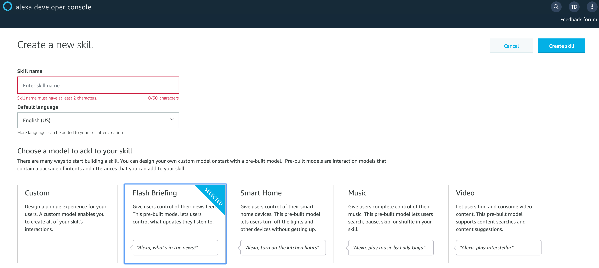
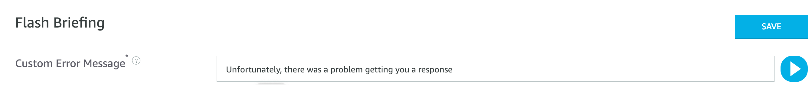
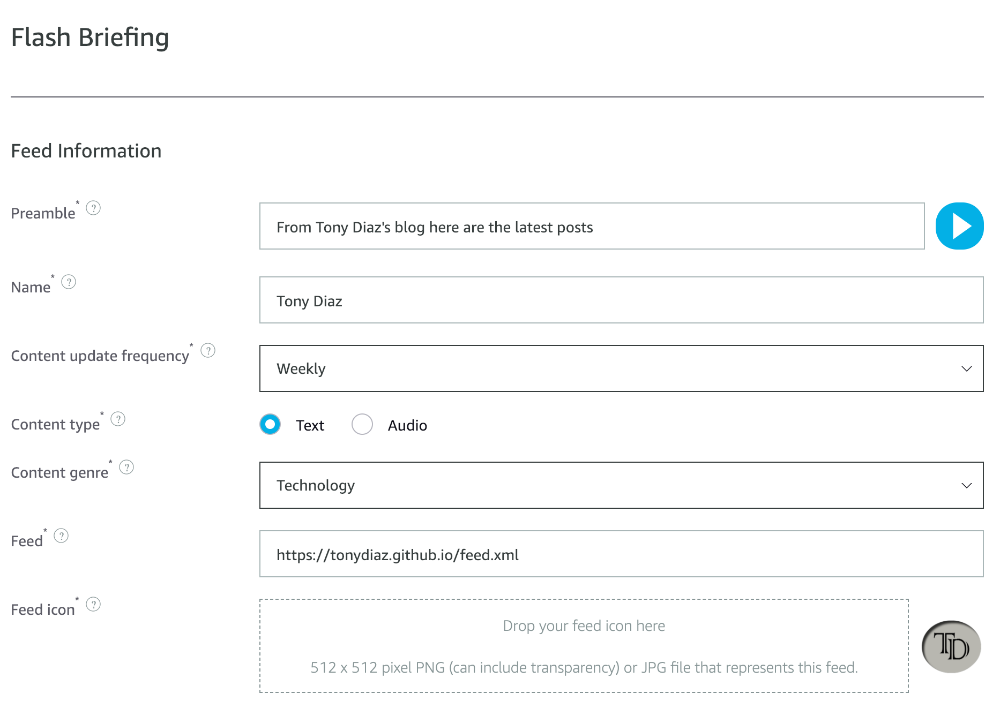

Happy New Year! I'm finishing this year by trying a few new technologies in my "spare" time. I wanted to see how easily i could create an Alexa skill and become familiar with the process to create roe in the future. I decided to create a simple one as sort of a "Hello World" skill.

I'll walk thrugh the steps I did to create one in less than about 10 minutes. First you need to sign up for [amazon developer account](https://developer.amazon.com).
Afterward you select that you want to create an Alexa skill. Enter the name of your skill and select Flash briefing. I selected this one because it only requires an RSS feed that Alexa can use to read news/articles back to the user. 

The next screen will be a FLash message to provide users if there is some error in your skill. I imagine if the feed is down for example. 

In the flash breifing section is where you add the URL for the feed and additional information about the feed. 

You can test the skill in their development environment and try to see if ti works.

The last step is filling out the distribution information. THis is where you add a description for the Alexa Skill market and add branding icons as needed.

Once this section is filled out including the Privacy and Compliance information you can submit your skill for review. And that is it!

If you want to check out my skill just say `"Alexa activate Tony Diaz skill`